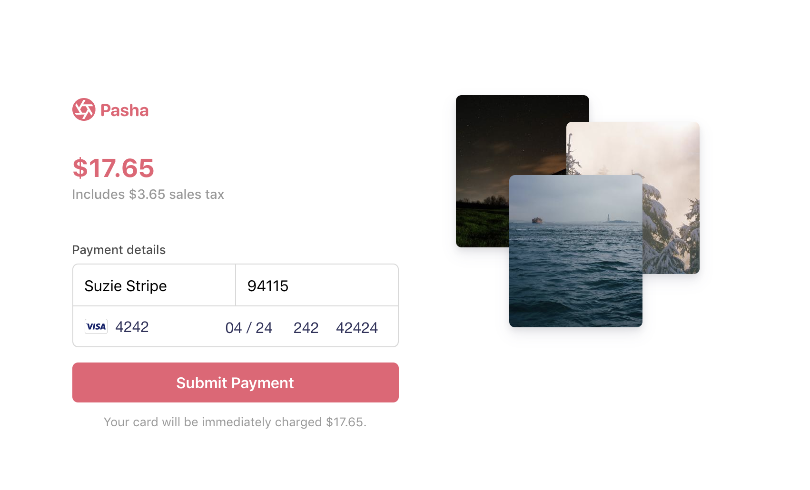

# Sales Tax Sample
There are two things certain in life: death and taxes.

Use this sample to learn how to build a minimal checkout form with a sales tax estimator and charge a card using the new [Payment Intents API](https://stripe.com/docs/payments/payment-intents). We use simplified logic for calculating sales tax, so you can replace the logic with your own method to suit your unique business needs. The amount of sales tax to collect depends on the product, customer location, and local tax laws.

**Demo**

See a [hosted version](https://cf6kr.sse.codesandbox.io/) of the sample or fork on [codesandbox.io](https://codesandbox.io/s/stripe-sample-sales-tax-cf6kr)

The hosted demo is running in test mode -- use `4242424242424242` as a test card number with any CVC + future expiration date.

Use the `4000000000003220` test card number to trigger a 3D Secure challenge flow.

Read more about test cards on Stripe at https://stripe.com/docs/testing.



There are two ways you can implementate this sample:
* Using webhooks to run any post-payment process (e.g. sending an email, shipping an order)
* Confirming the payment on your server and running any post-payment process immediately after (without using webhooks)

<!-- prettier-ignore -->
|     | [Using webhooks](/using-webhooks) | [Without webhooks](/without-webhooks)
:--- | :---: | :---:
💳 **Collecting card and cardholder details.** Both integrations use [Stripe Elements](https://stripe.com/docs/stripe-js) to build a custom checkout form. | ✅  | ✅ |
🙅 **Handling card authentication requests and declines.** Attempts to charge a card can fail if the bank declines the purchase or requests extra authentication.  | ✅  | ✅ |
↪️ **Easily scalable to other payment methods.** Webhooks enable easy adoption of other asynchroneous payment methods like direct debits and push-based payment flows. | ✅ | ❌ |
💰 **Tracking multiple payment attempts in a PaymentIntent.** Automatic confirmation lets you use a single PaymentIntent for multiple payment attempts so you can track the customer's payment session in one object. | ✅ | ❌ |


## How to run locally

Before you run the sample, be sure to you have a Stripe account with its own set of [API keys](https://stripe.com/docs/development/quickstart#api-keys).

Each sample implementation includes 5 servers in Node, Ruby, Python, Java, and PHP in the /server/ directory. 

**1. Clone and configure the sample**

The Stripe CLI is the fastest way to clone and configure a sample to run locally. 

**Using the Stripe CLI**

If you haven't already installed the CLI, follow the [installation steps](https://github.com/stripe/stripe-cli#installation) in the project README. The CLI is useful for cloning samples and locally testing webhooks and Stripe integrations.

In your terminal shell, run the Stripe CLI command to clone the sample:

```
stripe samples create adding-sales-tax
```

The CLI will walk you through picking your integration type, server and client languages, and configuring your .env config file with your Stripe API keys. 

**Installing and cloning manually**

If you do not want to use the Stripe CLI, you can manually clone and configure the sample yourself:

```
git clone https://github.com/stripe-samples/adding-sales-tax
```

Copy the .env.example file into a file named .env in the folder of the server you want to use. For example:

```
cp .env.example using-webhooks/server/node/.env
```

Go to the Stripe [developer dashboard](https://stripe.com/docs/development/quickstart#api-keys) to find your API keys.

```
STRIPE_PUBLISHABLE_KEY=<replace-with-your-publishable-key>
STRIPE_SECRET_KEY=<replace-with-your-secret-key>
```

**2. Follow the server instructions on how to run:**

Pick the server language you want and follow the instructions in the server folder README on how to run.

For example, if you want to run the Node server in `using-webhooks`:

```
cd using-webhooks/server/node # there's a README in this folder with instructions
npm install
npm start
```

## FAQ
Q: Why did you pick these frameworks?

A: We chose the most minimal framework to convey the key Stripe calls and concepts you need to understand. These demos are meant as an educational tool that helps you roadmap how to integrate Stripe within your own system independent of the framework.

## Get support
If you found a bug or want to suggest a new [feature/use case/sample], please [file an issue](../../issues).

If you have questions, comments, or need help with code, we're here to help:
- on [IRC via freenode](https://webchat.freenode.net/?channel=#stripe)
- on Twitter at [@StripeDev](https://twitter.com/StripeDev)
- on Stack Overflow at the [stripe-payments](https://stackoverflow.com/tags/stripe-payments/info) tag
- by [email](mailto:support+github@stripe.com)

## Author(s)
[@adreyfus-stripe](https://twitter.com/adrind)
